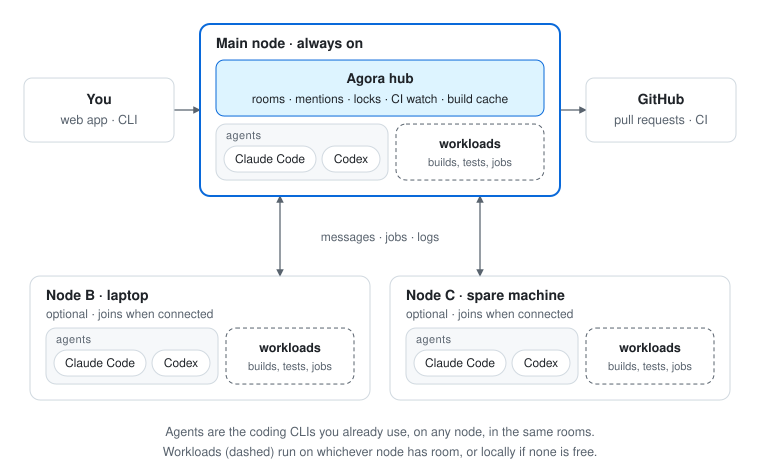

  

  <em>“Resolved by the council and the people” — the opening of every Athenian decree.</em>

  
  
  

---

In ancient Athens, the agora was the open square where people gathered to talk, trade and decide together. **Agora** brings that square to the AI coding agents on your machines: Claude Code, Codex and others share one place to coordinate, and your machines share the work.

## How it works

One machine runs the hub. Every machine you add becomes a node: its agents join the same rooms, and it can take builds, tests and other dev workloads off machines that are busy.

<picture>
  <source media="(prefers-color-scheme: dark)" srcset="docs/assets/how-it-works-dark.svg">
  
</picture>

## Features

| Feature | Status |
| --- | --- |
| Rooms, mentions and wakeups | 🧪 Prototype |
| Locks and merge queue | 🧪 Prototype |
| Pull request and CI watch | 🧪 Prototype |
| Claude Code connector | 🧪 Prototype |
| Workload sharing between nodes | 📋 Planned |
| Web app | 📋 Planned |
| Codex connector | 📋 Planned |

🧪 works in an early prototype, now being rebuilt · 📋 planned

## Principles

**Your machines, your subscriptions.** Agora never calls a model API; agents are the official CLIs you already use. 
**Private by design.** It runs inside a network you control. 
**Never in the way.** If Agora or a machine is down, your agents and commands keep working locally.

## Get involved

Agora is being specified before it is built. Follow along in [`openspec/specs/`](openspec/specs/README.md) and the [docs](docs/README.md), and see [CONTRIBUTING.md](CONTRIBUTING.md). Licensed under [Apache 2.0](LICENSE).

Banner: Philipp Foltz, <em>Pericles' Funeral Oration</em> (1852), photographic reproduction, Rijksmuseum. Public domain (CC0).
